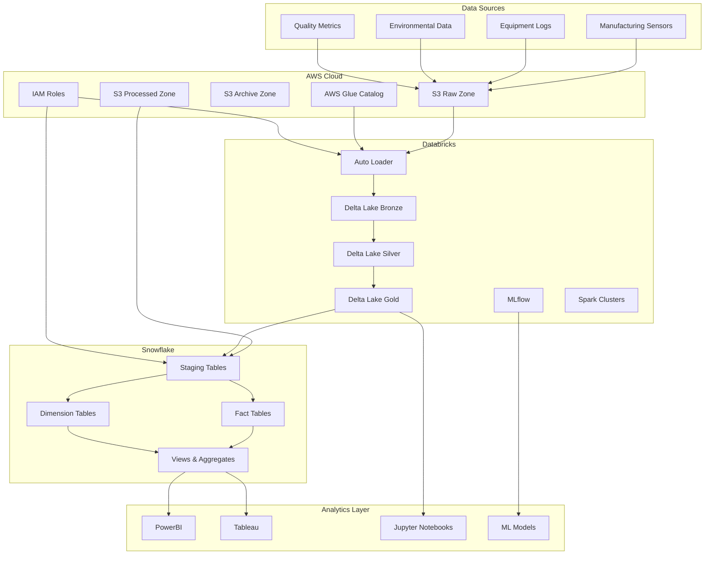

# Data Pipeline Architecture

## 🏗️ High-Level Architecture



## 🔄 Data Flow Architecture


## 🏛️ Medallion Architecture (Bronze, Silver, Gold)

### Bronze Layer (Raw Data)
- **Purpose**: Store raw, unprocessed data
- **Format**: Delta Lake tables
- **Schema**: Flexible, schema-on-read
- **Retention**: 2+ years for compliance

```
bronze/
├── sensor_data/
│   ├── year=2024/
│   │   ├── month=01/
│   │   │   ├── day=01/
│   │   │   └── day=02/
│   │   └── month=02/
│   └── year=2025/
├── equipment_logs/
└── quality_metrics/
```

### Silver Layer (Cleaned Data)
- **Purpose**: Cleaned, validated, and deduplicated data
- **Format**: Delta Lake with enforced schema
- **Quality**: Data quality rules applied
- **Partitioning**: By date and sensor_id

```
silver/
├── cleaned_sensor_data/
├── validated_equipment_logs/
└── processed_quality_metrics/
```

### Gold Layer (Business-Ready Data)
- **Purpose**: Aggregated, enriched data for analytics
- **Format**: Optimized Delta Lake tables
- **Access**: Business users and BI tools
- **Performance**: Z-ordered and optimized

```
gold/
├── hourly_sensor_aggregates/
├── daily_equipment_summary/
├── quality_trends/
└── anomaly_detection/
```

## 🔐 Security Architecture


## 📊 Monitoring & Observability


## 🎯 Non-Functional Requirements

### Performance
- **Latency**: <2 hours for batch processing, <5 minutes for streaming
- **Throughput**: Handle 1TB+ daily data volume
- **Concurrency**: Support 50+ concurrent users

### Scalability
- **Horizontal scaling**: Auto-scaling clusters
- **Storage**: Unlimited S3 and Snowflake scaling
- **Compute**: On-demand resource allocation

### Reliability
- **Availability**: 99.9% uptime SLA
- **Disaster Recovery**: Multi-region backup
- **Fault Tolerance**: Automatic retry mechanisms

### Security
- **Data Encryption**: End-to-end encryption
- **Access Control**: Role-based permissions
- **Audit Logging**: Complete audit trail

## 🔧 Technology Decisions

### Why Databricks?
- Native Spark integration
- Delta Lake for ACID transactions
- MLflow for ML lifecycle
- Auto-scaling capabilities

### Why Snowflake?
- Separate compute and storage
- Auto-scaling warehouses
- Zero-copy cloning
- Built-in optimization

### Why AWS S3?
- Virtually unlimited storage
- Multiple storage classes
- Strong integration ecosystem
- Cost-effective

## 📋 Architecture Validation Checklist

- [ ] **Scalability**: Can handle 10x current data volume
- [ ] **Performance**: Meets latency requirements
- [ ] **Security**: Follows security best practices
- [ ] **Cost**: Within budget constraints
- [ ] **Maintainability**: Easy to operate and troubleshoot
- [ ] **Flexibility**: Can adapt to changing requirements
